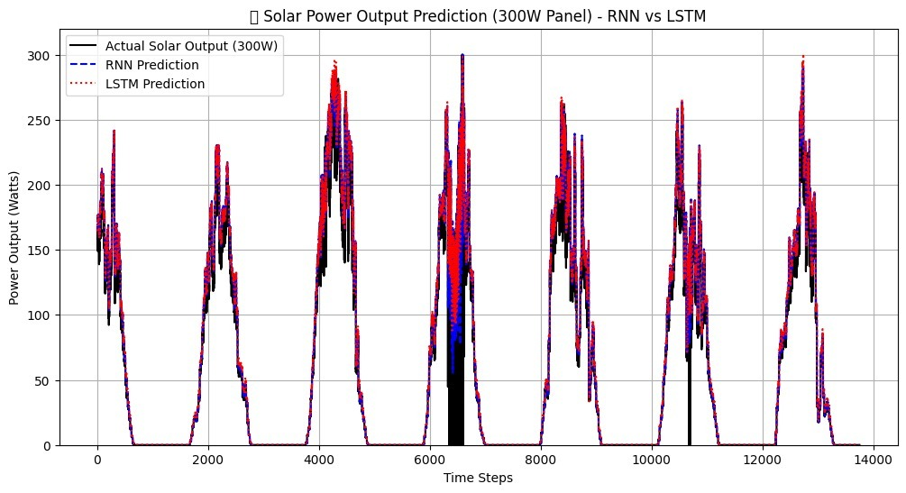

🌞 Real-Time Monitoring of Solar Power Output Using Recurrent Neural Networks (RNN)

📘 Project Overview

This project presents an AI-driven IoT system for real-time monitoring and prediction of solar power output.
It integrates ESP32-based sensors (voltage, current, temperature) with Recurrent Neural Networks (RNN/LSTM) implemented in Python (TensorFlow) to forecast short-term solar energy generation.

The system displays both live sensor readings and predicted power on a web interface (Flask/Firebase) and stores data locally on an SD card or in Google Sheets for future analysis.

⚙️ Features

Real-time monitoring of:
🌡️ Temperature (DHT11)
⚡ Voltage (ZMPT101B)
🔌 Current (ACS712)

Instantaneous power calculation:
P=V×I

RNN/LSTM model trained using TensorFlow for solar power prediction
Real-time visualization using Flask Web Dashboard / Firebase Cloud
Data logging to SD card and Google Sheets
Works without continuous laptop connection (Firebase + GitHub Pages)

🧠 System Architecture
Solar Panel → Sensors (V, I, T)
      ↓
   ESP32 (Data Collection)
      ↓ Wi-Fi
Firebase Cloud / Google Sheets
      ↓
Python (TensorFlow RNN / LSTM)
      ↓
Web Dashboard (Flask / GitHub Pages)

🧩 Hardware Components
           
ESP32	         
ACS712 (5A)	     
ZMPT101B	 
DHT11	         
SD Card Module   
DC-DC Buck Converter 
10W Solar Panel	Power source for prototype
Jumper Wires, Breadboard, LCD (16x2)	

💻 Software & Tools
	
Programming	
     Arduino IDE, Python (VS Code / Jupyter Notebook)
AI Libraries	
     TensorFlow, NumPy, Pandas, Matplotlib
Web Development	
     HTML, CSS, JavaScript, Flask
Cloud Integration
 	Firebase, Google Sheets API
Visualization
	Matplotlib / Chart.js
Dataset Source
	Kaggle, NREL Solar Data

🚀 Work Methodology

Component Selection & Circuit Design
→ Sensors connected to ESP32, tested in Arduino IDE.

Data Collection
→ Real-time values stored in SD card and Google Sheets.

Model Development
→ RNN & LSTM models trained using TensorFlow.

Visualization
→ Predicted vs actual power plotted and displayed on a web dashboard.

Deployment
→ Website hosted on GitHub Pages, data streamed from Firebase Cloud.

📊 Experimental Results

Real and predicted outputs closely match under various sunlight conditions.
RNN/LSTM successfully forecasts short-term solar output (5–10 min intervals).
DC–DC converter provides stable load voltage even under fluctuating sunlight.

🌐 Real-Time Web Dashboard
Displays live sensor data and predicted power output.
Accessible through Firebase or GitHub Pages without laptop connection.
Graphs auto-update every few seconds for dynamic monitoring.

🔧 Future Enhancements
Integration with AWS IoT / Firebase Realtime DB for large-scale deployment.
Addition of irradiance sensors for improved model accuracy.
Implementation of Edge AI on ESP32 for on-device prediction.
Mobile app interface for remote monitoring.

📚 References
National Renewable Energy Laboratory (NREL)
Kaggle – Solar Power Generation Dataset
TensorFlow Documentation – RNN/LSTM Forecasting
IEEE & MDPI Journals on AI-based Solar Prediction

## Author
**Abdul Saleem A**  
B.Tech in Electrical and Electronics Engineering (AI/ML)  
📎 [LinkedIn](https://www.linkedin.com/in/abdulsaleem03)  
🐙 [GitHub](https://github.com/CodeWithAbdulSaleem)

🏁 License
This project is for academic and educational purposes.
Feel free to fork and modify with proper credit to the authors.